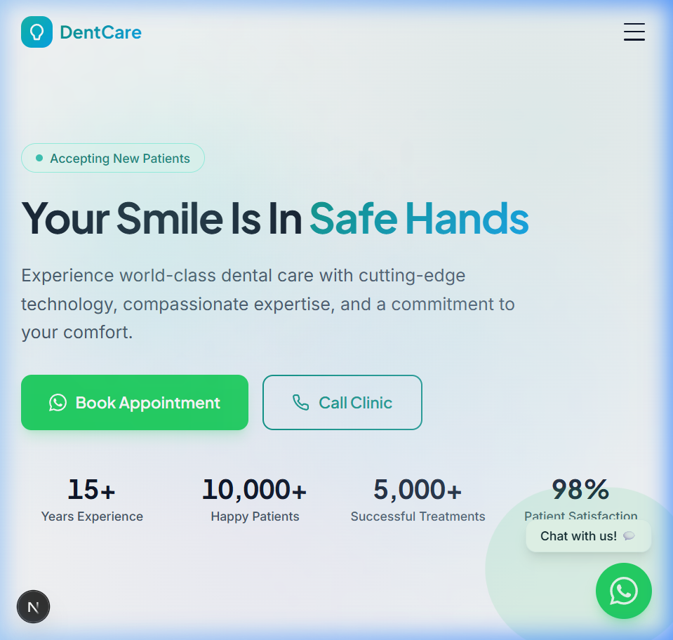
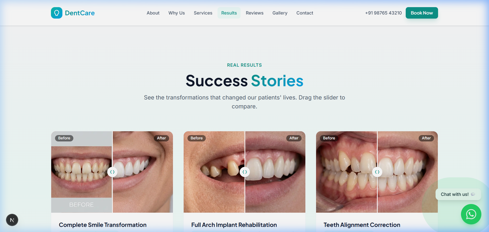
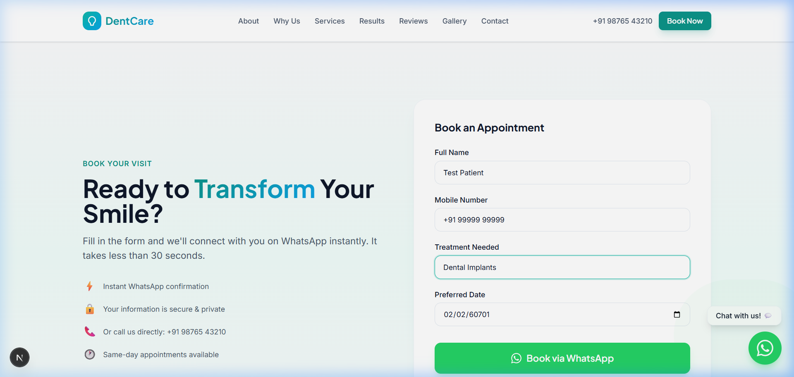
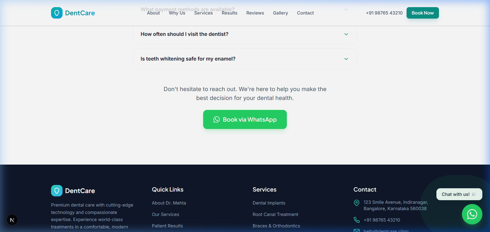
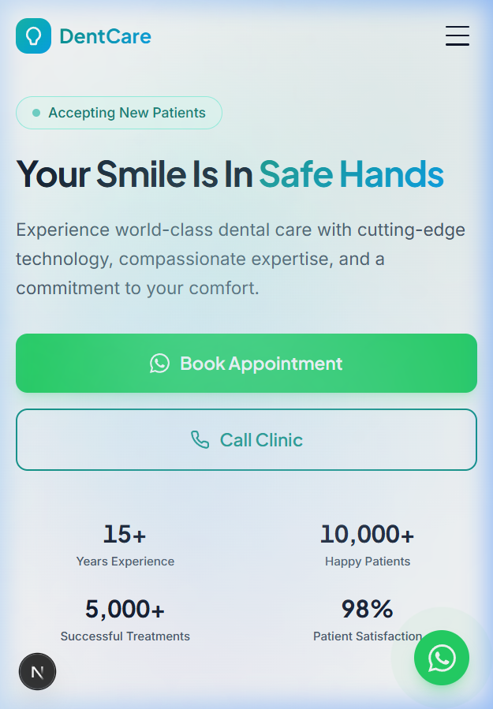
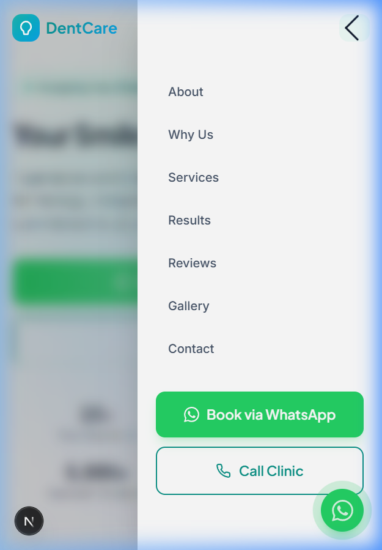

# DentCare — Project Walkthrough

> **Version**: 1.0.0  
> **Date**: 24 June 2026  
> **Author**: Dileep Patel  
> **Repository**: [github.com/dileeppatel74157/dentis-work](https://github.com/dileeppatel74157/dentis-work)

---

## Table of Contents

1. [Project Overview](#1-project-overview)
2. [Tech Stack](#2-tech-stack)
3. [Project Structure](#3-project-structure)
4. [Architecture & Design](#4-architecture--design)
5. [Pages & Sections](#5-pages--sections)
6. [Component Breakdown](#6-component-breakdown)
7. [WhatsApp Integration](#7-whatsapp-integration)
8. [Mobile Responsiveness](#8-mobile-responsiveness)
9. [Design System](#9-design-system)
10. [SEO & Metadata](#10-seo--metadata)
11. [Setup & Installation](#11-setup--installation)
12. [Deployment Guide](#12-deployment-guide)
13. [Testing Results](#13-testing-results)
14. [Screenshots](#14-screenshots)

---

## 1. Project Overview

**DentCare** is a premium, single-page dental clinic website designed to convert visitors into patients. It features a modern, animated UI with full WhatsApp integration for appointment booking.

### Key Features

| Feature | Description |
|---------|-------------|
| **Single-Page Design** | All content on one scrollable page with smooth anchor navigation |
| **WhatsApp Booking** | Every CTA opens WhatsApp with a pre-filled message to +91 7489923699 |
| **Before/After Gallery** | Interactive slider comparing dental treatment results |
| **Booking Form** | Full appointment form that sends details via WhatsApp |
| **Responsive Design** | Optimized for desktop, tablet, and mobile viewports |
| **Animations** | Smooth scroll-triggered animations using Framer Motion |
| **Glassmorphism Navbar** | Transparent → frosted-glass navbar on scroll |
| **Floating WhatsApp CTA** | Persistent bottom-right button with pulse animation |

---

## 2. Tech Stack

| Technology | Version | Purpose |
|------------|---------|---------|
| **Next.js** | 16.2.9 | React framework (App Router, SSR/SSG) |
| **React** | 19.2.4 | UI library |
| **TypeScript** | 5.x | Type safety |
| **Tailwind CSS** | 4.x | Utility-first styling |
| **Framer Motion** | 12.40.0 | Animations and transitions |
| **Google Fonts** | — | Plus Jakarta Sans (display) + Inter (body) |
| **PostCSS** | — | CSS processing pipeline |
| **ESLint** | 9.x | Code linting |

### Why These Choices?

- **Next.js 16**: Latest App Router with Turbopack for fast builds (~5s), automatic image optimization, and static generation.
- **Tailwind CSS 4**: New `@theme` directive for design tokens, no separate config file needed.
- **Framer Motion**: Production-grade animations with `whileInView` for scroll-triggered effects.
- **TypeScript**: All components and data are fully typed for maintainability.

---

## 3. Project Structure

```
dentcare/
├── docs/                        # Documentation & screenshots
│   ├── WALKTHROUGH.md           # This file
│   └── screenshots/             # Visual test screenshots
├── public/
│   └── images/
│       ├── doctor.jpg           # Doctor profile photo
│       ├── doctor-hero.jpg      # Hero section doctor photo
│       ├── gallery/             # 6 clinic gallery images
│       ├── services/            # 9 service images
│       └── stories/             # 6 before/after images (3 pairs)
├── src/
│   ├── app/
│   │   ├── globals.css          # Global styles + Tailwind theme
│   │   ├── layout.tsx           # Root layout (fonts, metadata)
│   │   ├── page.tsx             # Main page (assembles all sections)
│   │   └── favicon.ico
│   ├── components/
│   │   ├── layout/
│   │   │   ├── Navbar.tsx       # Navigation bar (desktop + mobile)
│   │   │   ├── Footer.tsx       # Footer with map, links, social
│   │   │   └── FloatingCTA.tsx  # Floating WhatsApp button
│   │   ├── sections/
│   │   │   ├── Hero.tsx         # Hero banner with doctor image
│   │   │   ├── DoctorProfile.tsx # Doctor bio, qualifications, expertise
│   │   │   ├── WhyTrustUs.tsx   # 6 trust pillar cards
│   │   │   ├── Specialties.tsx  # 9 expandable service cards
│   │   │   ├── SuccessStories.tsx # Before/after interactive slider
│   │   │   ├── Testimonials.tsx # Patient review carousel
│   │   │   ├── Satisfaction.tsx # Animated satisfaction metrics
│   │   │   ├── Gallery.tsx      # Filterable image gallery + lightbox
│   │   │   ├── Booking.tsx      # Appointment booking form
│   │   │   └── FAQ.tsx          # Accordion FAQ section
│   │   └── ui/
│   │       ├── Button.tsx       # Reusable button (5 variants)
│   │       ├── SectionCTA.tsx   # Reusable "Book via WhatsApp" CTA
│   │       ├── Counter.tsx      # Animated number counter
│   │       ├── StarRating.tsx   # Star rating display
│   │       └── ComparisonSlider.tsx # Before/after slider util
│   └── lib/
│       └── constants.ts         # All data, config, WhatsApp helpers
├── package.json
├── tsconfig.json
├── next.config.ts
├── postcss.config.mjs
└── eslint.config.mjs
```

**Total**: 23 source files | 63 files committed to Git

---

## 4. Architecture & Design

### Data-Driven Architecture

All content is centralized in `src/lib/constants.ts`:
- Clinic info (name, phone, address, hours)
- Doctor profile (bio, qualifications, awards)
- Services (9 treatments with descriptions, benefits, recovery info)
- Success stories (before/after image paths)
- Testimonials (5 patient reviews)
- FAQ data (7 questions)
- Gallery images (6 photos)
- WhatsApp number (`917489923699`)

**Why?** A single source of truth makes it easy to update content without touching component code. Changing the WhatsApp number or clinic name in one place updates it everywhere.

### Component Hierarchy

```
RootLayout (layout.tsx)
└── Home (page.tsx)
    ├── Navbar
    ├── Hero
    ├── DoctorProfile
    ├── WhyTrustUs
    ├── Specialties
    ├── SuccessStories
    ├── Testimonials
    ├── Satisfaction
    ├── Gallery
    ├── Booking
    ├── FAQ
    ├── Footer
    └── FloatingCTA
```

### Animation Strategy

All sections use Framer Motion's `whileInView` for scroll-triggered entrance animations:
- **Fade-up**: Most section headers and content blocks
- **Stagger**: Card grids animate one-by-one with 80-150ms delays
- **Spring**: Floating CTA and interactive elements use spring physics
- **Infinite**: Floating badges in Hero bounce with `repeat: Infinity`

---

## 5. Pages & Sections

The site is a **single-page application** with 11 content sections:

| # | Section | ID | Description |
|---|---------|-----|-------------|
| 1 | **Hero** | `#hero` | Full-viewport banner with headline, CTAs, trust metrics, doctor photo |
| 2 | **Doctor Profile** | `#doctor` | Doctor bio, qualifications, awards, expertise grid |
| 3 | **Why Trust Us** | `#why-us` | 6 trust pillars (Technology, Pain-Free, etc.) |
| 4 | **Specialties** | `#specialties` | 9 expandable service cards with WhatsApp enquiry |
| 5 | **Success Stories** | `#success-stories` | 3 before/after cases with interactive slider |
| 6 | **Testimonials** | `#testimonials` | 5 patient reviews with ratings |
| 7 | **Satisfaction** | `#satisfaction` | 4 animated metric counters |
| 8 | **Gallery** | `#gallery` | Filterable clinic photo gallery with lightbox |
| 9 | **Booking** | `#booking` | Appointment form → WhatsApp |
| 10 | **FAQ** | `#faq` | 7 expandable questions |
| 11 | **Footer** | `#footer` | Links, contact, hours, social, Google Maps |

---

## 6. Component Breakdown

### Layout Components

#### `Navbar.tsx`
- **Desktop**: Logo + 7 nav links + phone number + "Book Now" button
- **Mobile**: Logo + hamburger → slide-out drawer with nav + WhatsApp/Call buttons
- **Glassmorphism**: Transparent at top, frosted-glass (`backdrop-filter: blur(20px)`) on scroll
- **Body scroll lock**: Disables body scroll when mobile menu is open

#### `Footer.tsx`
- 4-column grid: Brand/Social, Quick Links, Services, Contact/Hours
- Embedded Google Maps iframe
- Bottom bar with copyright and legal links

#### `FloatingCTA.tsx`
- Fixed bottom-right WhatsApp button with pulse animation
- Tooltip "Chat with us! 💬" appears after 2-second delay (desktop only)
- Spring entrance animation with 1-second delay

### Section Components

#### `Hero.tsx`
- 2-column layout: content (left) + doctor image (right, desktop only)
- "Accepting New Patients" pulse badge
- Two CTAs: "Book Appointment" (WhatsApp) + "Call Clinic" (tel: link)
- Trust metrics with animated counters (15+ Years, 10,000+ Patients, etc.)
- Floating badges: "15+ Years Trusted Experience" and "4.9 Google Reviews"

#### `SuccessStories.tsx`
- **Before/After interactive slider**: Drag to reveal before vs. after
- Uses `Next/Image` for optimized image loading
- `clipPath: inset()` CSS for the reveal effect
- Touch-enabled for mobile (`onTouchMove`)
- 3 cases: Smile Makeover, Implant Rehabilitation, Invisalign

#### `Booking.tsx`
- 4 form fields: Name, Phone, Treatment (dropdown), Date
- Client-side validation with error messages
- On submit: constructs a formatted WhatsApp message and opens `wa.me/917489923699`
- Trust signals: "Instant WhatsApp confirmation", "Your info is secure", etc.

#### `Specialties.tsx`
- 9 service cards in a 3-column grid
- Each card: image + title overlay + short description
- Expandable: "Learn More" reveals full description, benefits list, recovery info, and "Enquire on WhatsApp" button
- Each enquiry button sends a treatment-specific message

#### `Gallery.tsx`
- Category filter tabs: All, Reception, Treatment Rooms, Equipment, Hygiene, Our Team
- First image spans 2 columns and 2 rows
- Click to open fullscreen lightbox with close button
- AnimatePresence for smooth filter transitions

### UI Components

#### `Button.tsx`
- **5 variants**: `primary`, `whatsapp`, `outline`, `ghost`, `secondary`
- **3 sizes**: `sm`, `md`, `lg`
- Supports `icon`, `iconRight`, `loading` state
- When `href` is provided, renders as `<a>` tag with `target="_blank"`
- Framer Motion hover/tap scale animations

#### `Counter.tsx`
- Animated number counter using `useInView` and `requestAnimationFrame`
- Supports decimal values, suffixes (+, %, etc.)
- Triggers only once when scrolled into view

#### `SectionCTA.tsx`
- Reusable "Book via WhatsApp" call-to-action block
- Used at the bottom of Doctor Profile, Success Stories, and FAQ sections
- Customizable title and subtitle

---

## 7. WhatsApp Integration

### How It Works

All WhatsApp functionality is centralized in `src/lib/constants.ts`:

```typescript
// Clinic WhatsApp number
whatsappNumber: "917489923699"  // +91 7489923699

// Helper functions
getWhatsAppLink(message?)       // Returns wa.me URL with optional pre-filled message
getBookingWhatsAppLink(data)    // Returns wa.me URL with formatted booking details
```

### WhatsApp Touchpoints (7 total)

| Location | Component | Pre-filled Message |
|----------|-----------|-------------------|
| Navbar "Book Now" | `Navbar.tsx` | "Hi, I'd like to book an appointment." |
| Hero "Book Appointment" | `Hero.tsx` | "Hi, I'd like to book an appointment." |
| Mobile menu button | `Navbar.tsx` | "Hi, I'd like to book an appointment." |
| Floating CTA (bottom-right) | `FloatingCTA.tsx` | "Hi, I'd like to know more about your dental services." |
| Booking form submit | `Booking.tsx` | Formatted message with Name, Phone, Treatment, Date |
| Service card "Enquire" | `Specialties.tsx` | "Hi, I'm interested in [Treatment]. Can you provide more info?" |
| Section CTAs | `SectionCTA.tsx` | "Hi, I'd like to book an appointment." |

### Booking Form → WhatsApp Flow

```
User fills form → Clicks "Book via WhatsApp" → Validates fields →
Opens: wa.me/917489923699?text=Hello,%0AI would like to book...
  Name: [user input]
  Phone: [user input]
  Treatment: [selected]
  Preferred Date: [selected]
```

### Changing the WhatsApp Number

To change the number, edit **one line** in `src/lib/constants.ts`:

```typescript
whatsappNumber: "917489923699",  // Change this number
```

All 7 touchpoints will update automatically.

---

## 8. Mobile Responsiveness

### Breakpoint Strategy

| Breakpoint | Width | Behavior |
|------------|-------|----------|
| **Mobile** | < 640px | Single column, stacked layout, hamburger menu |
| **Small tablet** | 640-767px (`sm:`) | 2-column grids, larger text |
| **Tablet** | 768-1023px (`md:`) | 2-column grids, adjusted spacing |
| **Desktop** | 1024px+ (`lg:`) | Full multi-column layouts, desktop nav |

### Mobile-Specific Features

- **Hamburger menu**: Replaces desktop nav links; slide-out drawer with backdrop
- **Body scroll lock**: Prevents background scroll when mobile menu is open
- **Touch slider**: Before/after comparison works with `onTouchMove`
- **Stacked CTAs**: Buttons stack vertically on mobile (`flex-col`)
- **Full-width forms**: All inputs expand to 100% width on mobile
- **Responsive images**: `sizes` attribute on Next.js `Image` for optimal loading
- **Floating CTA**: Smaller on mobile (w-14 h-14 vs w-16 h-16)

### Tested Viewports

| Device | Resolution | Status |
|--------|-----------|--------|
| iPhone SE | 375×667 | ✅ Passed |
| iPhone 14 Pro | 393×852 | ✅ Passed |
| iPad | 768×1024 | ✅ Passed |
| Desktop | 1280×900 | ✅ Passed |
| Desktop HD | 1536×864 | ✅ Passed |

---

## 9. Design System

### Color Palette

| Token | Hex | Usage |
|-------|-----|-------|
| `primary-500` | `#14b8a6` | Primary teal — buttons, links, accents |
| `primary-600` | `#0d9488` | Darker teal — hover states |
| `secondary-500` | `#0ea5e9` | Sky blue — gradient secondary |
| `whatsapp` | `#25d366` | WhatsApp brand green |
| `text-primary` | `#0f172a` | Main text color (slate-900) |
| `text-secondary` | `#475569` | Muted text (slate-600) |
| `background` | `#fafbfc` | Page background |

### Typography

| Font | Weight | Usage |
|------|--------|-------|
| **Plus Jakarta Sans** | 400-800 | Headings, buttons, display text |
| **Inter** | 400-700 | Body text, paragraphs, form inputs |

### Custom Utilities (globals.css)

| Class | Effect |
|-------|--------|
| `.gradient-text` | Teal → blue text gradient |
| `.glass` | Frosted glass with backdrop blur |
| `.card-hover` | Lift-on-hover with teal shadow |
| `.hero-gradient` | Multi-radial gradient background |
| `.section-gradient` | Subtle section background gradients |

### Animations

| Name | Duration | Usage |
|------|----------|-------|
| `float` | 6s infinite | Hero floating badges |
| `pulse-soft` | 2s infinite | Subtle scale pulsing |
| `gradient-shift` | 8s infinite | Moving gradient backgrounds |
| `fade-in` | 0.6s | General entrance |
| `slide-up` | 0.6s | Scroll-in sections |

---

## 10. SEO & Metadata

Configured in `src/app/layout.tsx`:

```
Title: "DentCare | Premium Dental Clinic – Expert Care, Beautiful Smiles"
Description: "Experience world-class dental care at DentCare. 15+ years of expertise..."
```

### SEO Features

- ✅ Semantic HTML5 (`<section>`, `<nav>`, `<footer>`, `<main>`)
- ✅ Single `<h1>` per page with proper heading hierarchy
- ✅ Open Graph meta tags (title, description, type, locale)
- ✅ Twitter Card meta tags
- ✅ Keywords array (dental clinic, dentist near me, implants, etc.)
- ✅ `robots: { index: true, follow: true }`
- ✅ Accessible `aria-label` on all icon buttons
- ✅ Proper `alt` text on all images
- ✅ `loading="lazy"` on non-critical images

---

## 11. Setup & Installation

### Prerequisites

- **Node.js** 18+ (recommended: 22.x)
- **npm** 9+
- **Git**

### Local Development

```bash
# Clone the repository
git clone https://github.com/dileeppatel74157/dentis-work.git
cd dentis-work

# Install dependencies
npm install

# Start development server
npm run dev
```

Open [http://localhost:3000](http://localhost:3000) in your browser.

### Build for Production

```bash
# Create optimized production build
npm run build

# Start production server
npm start
```

### Available Scripts

| Script | Command | Description |
|--------|---------|-------------|
| `dev` | `npm run dev` | Start dev server with Turbopack |
| `build` | `npm run build` | Create production build |
| `start` | `npm start` | Serve production build |
| `lint` | `npm run lint` | Run ESLint |

---

## 12. Deployment Guide

### Option 1: Vercel (Recommended)

1. Go to [vercel.com](https://vercel.com)
2. Import your GitHub repository: `dileeppatel74157/dentis-work`
3. Vercel auto-detects Next.js and configures everything
4. Click **Deploy** — your site is live in ~60 seconds

### Option 2: Netlify

1. Go to [netlify.com](https://netlify.com)
2. Connect your GitHub repository
3. Build command: `npm run build`
4. Publish directory: `.next`
5. Deploy

### Option 3: Self-Hosted

```bash
npm run build
npm start  # Starts on port 3000
```

Use a reverse proxy (Nginx/Apache) to serve on port 80/443.

---

## 13. Testing Results

### Build Test
```
✓ Compiled successfully in 5.2s (Turbopack)
✓ TypeScript — no errors
✓ 4/4 static pages generated in 1.4s
✓ 0 warnings, 0 errors
```

### Visual Testing (Desktop — 1280×900)

| Section | Status | Notes |
|---------|--------|-------|
| Navbar | ✅ Pass | Glassmorphism on scroll, all links work |
| Hero | ✅ Pass | Animations, counters, floating badges |
| Doctor Profile | ✅ Pass | Image, qualifications, awards |
| Why Trust Us | ✅ Pass | 6 cards with icons |
| Specialties | ✅ Pass | 9 cards, expand/collapse, WhatsApp enquiry |
| Success Stories | ✅ Pass | Real before/after images with slider |
| Testimonials | ✅ Pass | 5 reviews with ratings |
| Satisfaction | ✅ Pass | Animated counters |
| Gallery | ✅ Pass | Category filter + lightbox |
| Booking | ✅ Pass | Form validation + WhatsApp submit |
| FAQ | ✅ Pass | Accordion expand/collapse |
| Footer | ✅ Pass | Links, map, social icons |
| Floating CTA | ✅ Pass | WhatsApp button with pulse |

### Mobile Responsiveness (375×812)

| Check | Status |
|-------|--------|
| Hamburger menu | ✅ Works correctly |
| No horizontal overflow | ✅ Confirmed |
| Sections stack vertically | ✅ All sections responsive |
| Text readability | ✅ No truncation |
| Touch targets | ✅ All buttons tappable |
| Before/after slider | ✅ Touch-enabled |
| Booking form | ✅ Full-width, accessible |
| Floating WhatsApp CTA | ✅ Properly positioned |

### WhatsApp Integration

| Touchpoint | Target Number | Status |
|------------|:---:|:---:|
| Navbar "Book Now" | 917489923699 | ✅ |
| Hero "Book Appointment" | 917489923699 | ✅ |
| Mobile menu | 917489923699 | ✅ |
| Floating CTA | 917489923699 | ✅ |
| Booking form | 917489923699 | ✅ |
| Service enquiry buttons | 917489923699 | ✅ |
| Section CTAs | 917489923699 | ✅ |

---

## 14. Screenshots

### Desktop — Hero Section


### Desktop — Before/After Stories


### Desktop — Booking Form


### Desktop — Footer


### Mobile — Hero


### Mobile — Navigation Menu


---

## Quick Reference

| Item | Value |
|------|-------|
| **GitHub Repo** | https://github.com/dileeppatel74157/dentis-work |
| **WhatsApp Number** | +91 7489923699 |
| **Framework** | Next.js 16.2.9 |
| **Total Source Files** | 23 |
| **Total Committed Files** | 63 |
| **Build Time** | ~5 seconds |
| **Static Pages** | 4 |

---

*Document generated on 24 June 2026*
